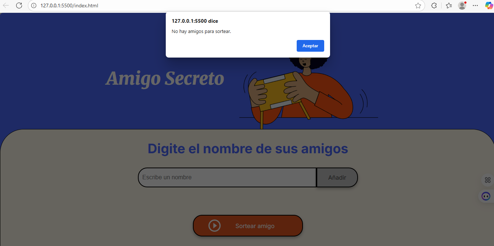
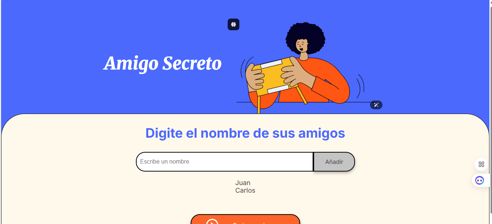
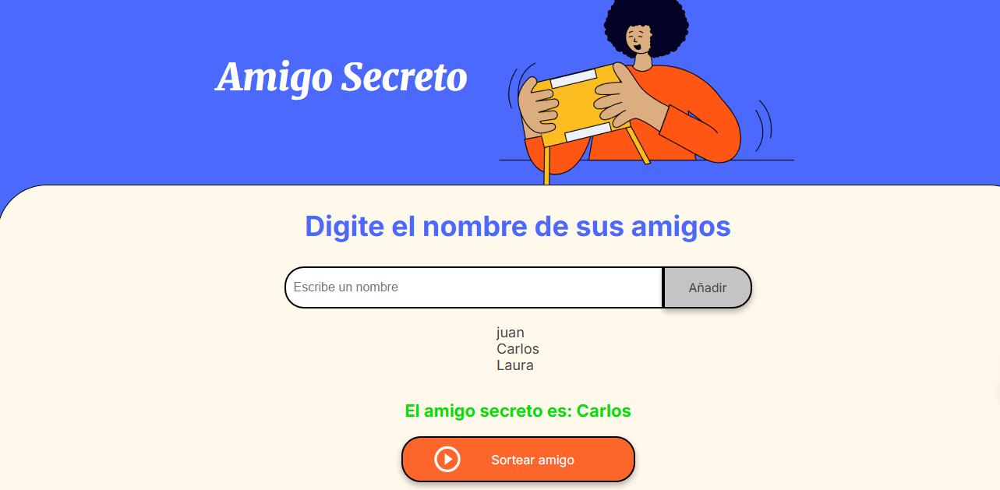

                                            #Amigo Secreto
                                        ##Challenge Alura Latam
1. Descripcion del proyecto
Este proyecto es una aplicacion web simple que permite  agregar nombres a  una lista y realizar un sorteo aleatorio para  elegir un amigo secreto.
2. Estructura del proyecto 
    - mindex.html → Contiene la estructura principal de la página.
    - style.css → Archivo de estilos para el diseño y la presentación.
    - app.js → Contiene la lógica del programa en JavaScript.
    - assets/ → Carpeta con imágenes utilizadas en la interfaz.
3. Funcionalidades 
    - Agregar nombres de amigos a una lista.
    - Validar que no se ingresen campos vacíos.
    - Mostrar la lista actualizada en pantalla.
    - Realizar un sorteo aleatorio entre los nombres agregados.
    - Mostrar el resultado del sorteo en el DOM.
4. Como usarlo 
    - Abrir el archivo index.html en un navegador.
    - Escribir el nombre de un amigo en el campo de texto.
    - Hacer clic en Añadir para agregarlo a la lista.
    - Una vez que se tengan varios nombres, presionar Sortear amigo.
    - Se mostrará en pantalla el nombre del amigo secreto seleccionado.
5. Tecnologias utilizadas 
    - HTML5
    - CSS3
    - Javascript
6. Vista previa 
    - Si no ingresamos ningun dato e intentamos  hacer un sorteo nos mandara una alerta
    
    - Agregamos a los amigos en la lista 
    
    - Una vez  ingresado a los amigos  en  la lista y procedemos con elsorteo
    